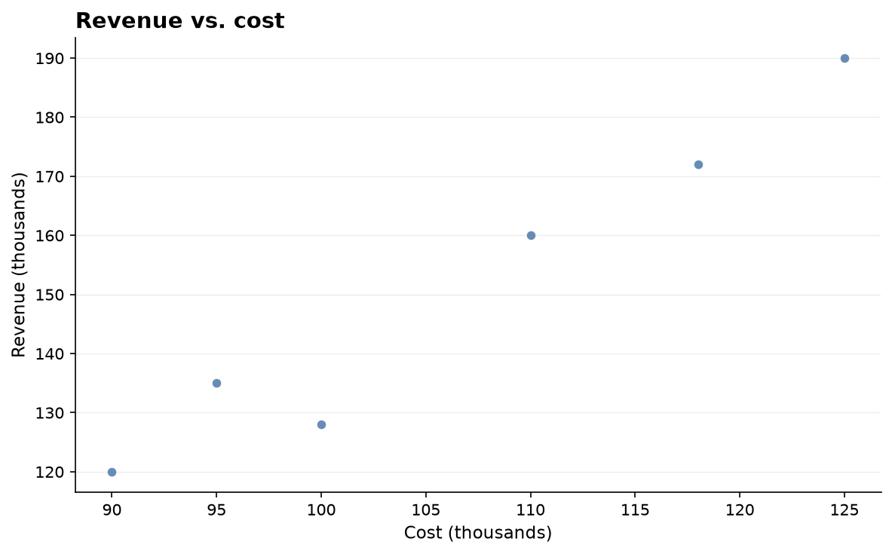

# Examples

Runnable examples for `simple_eda`. Every example script renders its charts to
`examples/images/` so you can see the output without running anything.

**Convention:** every new `.py` example ships with at least one rendered
visualization committed under `images/`.

| Script | Renders |
| --- | --- |
| [`quickstart.py`](quickstart.py) | Picking the right chart per question, with a single accent color used to highlight the key point |

Run any example from the repo root:

```bash
pip install -e .
python examples/quickstart.py
```

## quickstart.py

A line for the trend (revenue accented), a bar chart comparing months (the
standout accented), a scatter for the cost/revenue relationship, and a
histogram for the growth distribution.




