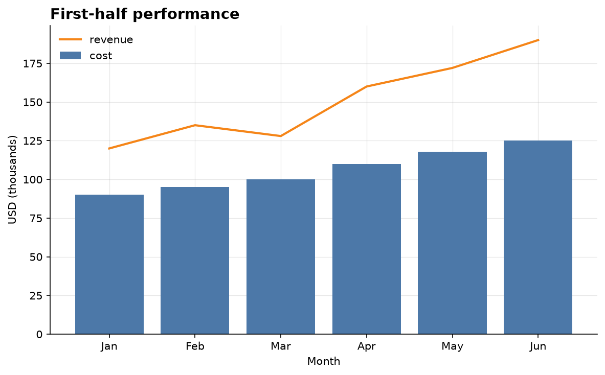

# Examples

Runnable examples for `simple_eda`. Every example script renders its charts to
`examples/images/` so you can see the output without running anything.

**Convention:** every new `.py` example ships with at least one rendered
visualization committed under `images/`.

| Script | Renders |
| --- | --- |
| [`quickstart.py`](quickstart.py) | A layered bar+line chart, a scatter, and a histogram |

Run any example from the repo root:

```bash
pip install -e .
python examples/quickstart.py
```

## quickstart.py




