# Examples

Runnable examples for `simple_eda`. Every example script renders its charts to
`examples/images/` so you can see the output without running anything.

**Convention:** every new `.py` example ships with at least one rendered
visualization committed under `images/`.

| Script | Renders |
| --- | --- |
| [`quickstart.py`](quickstart.py) | A tour of the chart types on the NFL leaders dataset: line, bar, dot, and histogram |
| [`nfl_leaders.py`](nfl_leaders.py) | Analyzes NFL season leaders 2020–24: the standout season per category and the most consistent leaders |
| [`nfl_totals.py`](nfl_totals.py) | Aggregates leaders across seasons (not split by year) and surfaces the accumulation outliers |

Run any example from the repo root:

```bash
pip install -e .
python examples/quickstart.py
```

## quickstart.py

A tour of the chart types on the NFL season-leaders dataset: a **line** for the
passing-yards crown over time, a **bar** for rushing-yards leaders (standout
accented), a **dot** plot for receiving-yards leaders, and a **histogram** for
the spread of skill-position yardage leaders.

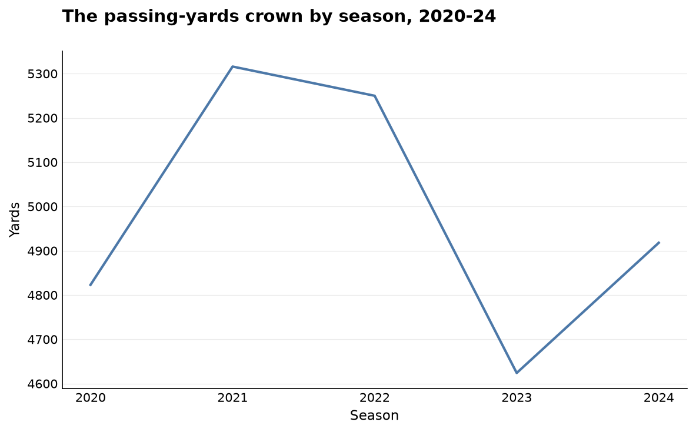
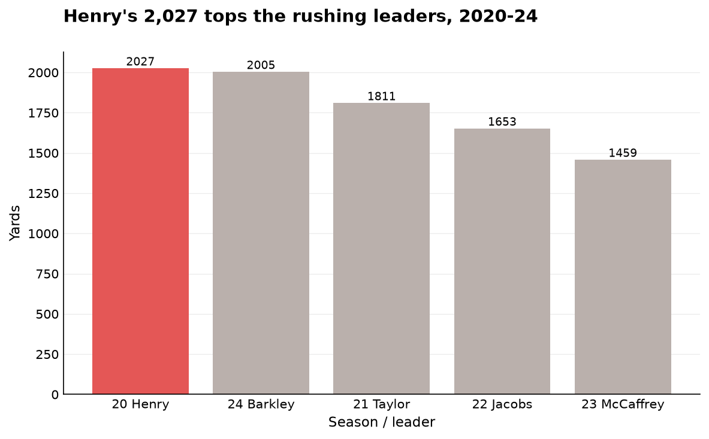
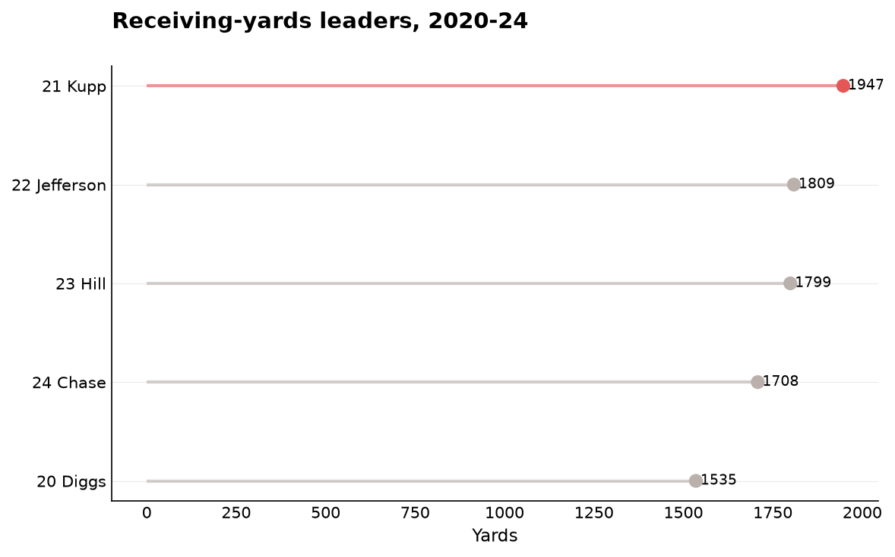
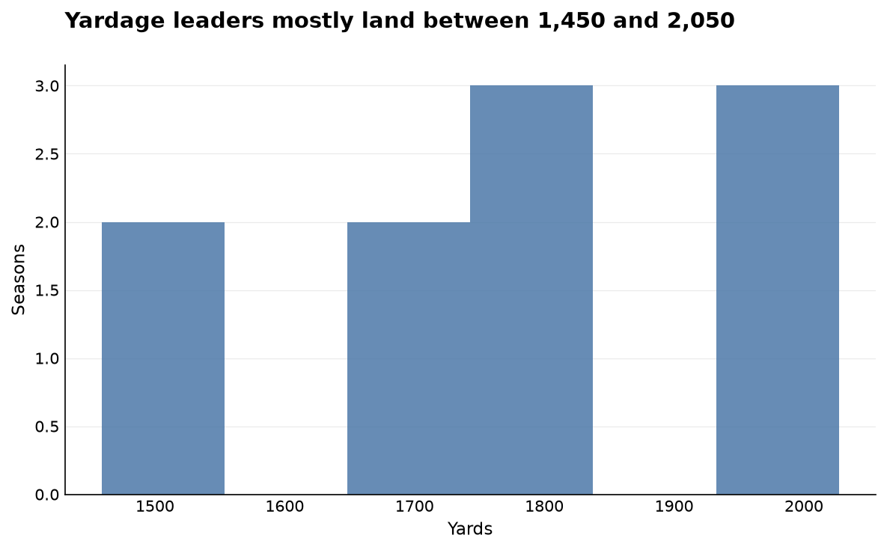

## nfl_leaders.py

Analyzes the NFL season leaders in
[`../datasets/nfl_leaders_2020_2024.csv`](../datasets/nfl_leaders_2020_2024.csv)
(compiled from model knowledge — verify vs. PFR). For each category it accents
the **standout (highest) season**, and a final chart ranks the **most
consistent** leaders (most category-seasons led). Findings: peaks like Henry's
2,027 rushing yards (2020), Brady's 5,316 passing yards (2021), Kupp's 1,947
receiving yards (2021), and Watt's 22.5 sacks (2021) — with **T.J. Watt** the
most consistent, leading a category in three of the five seasons.

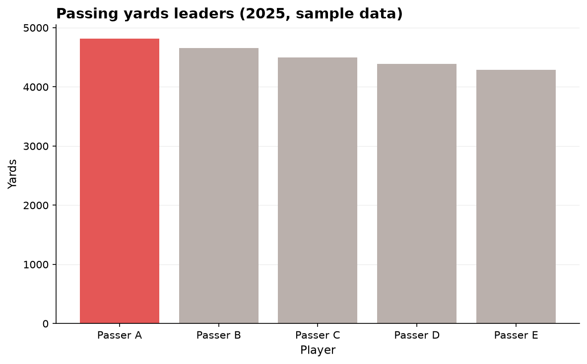
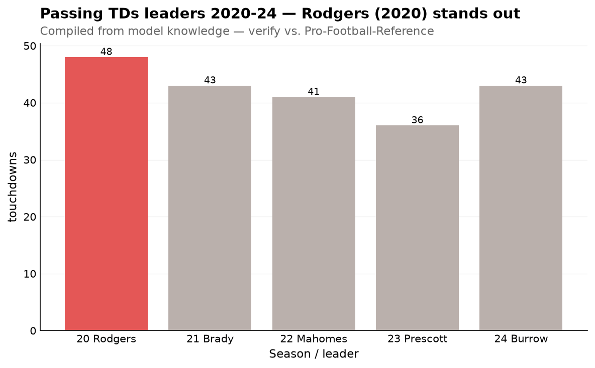
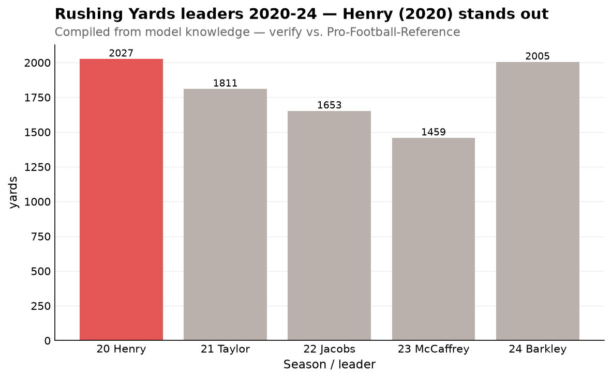
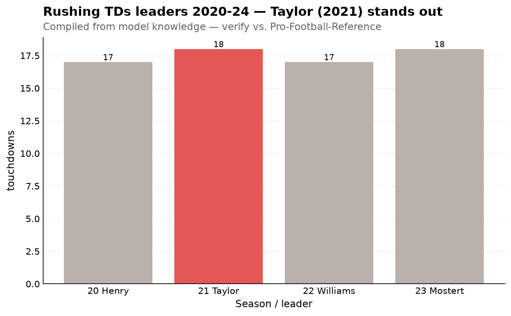
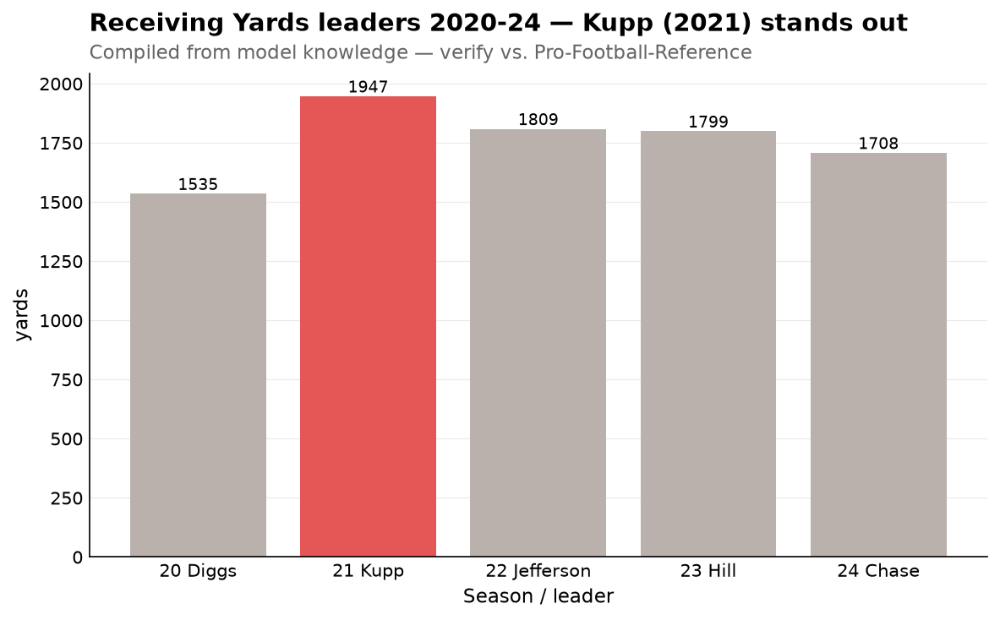
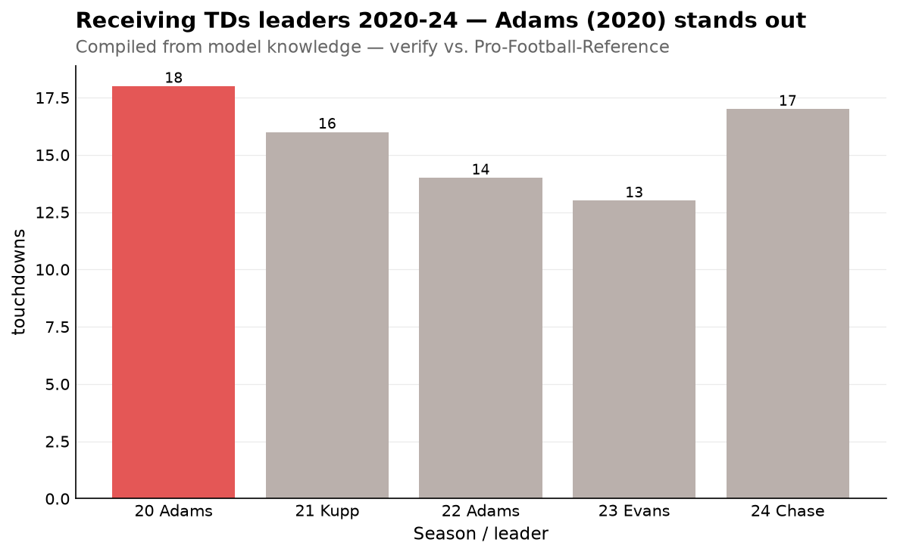
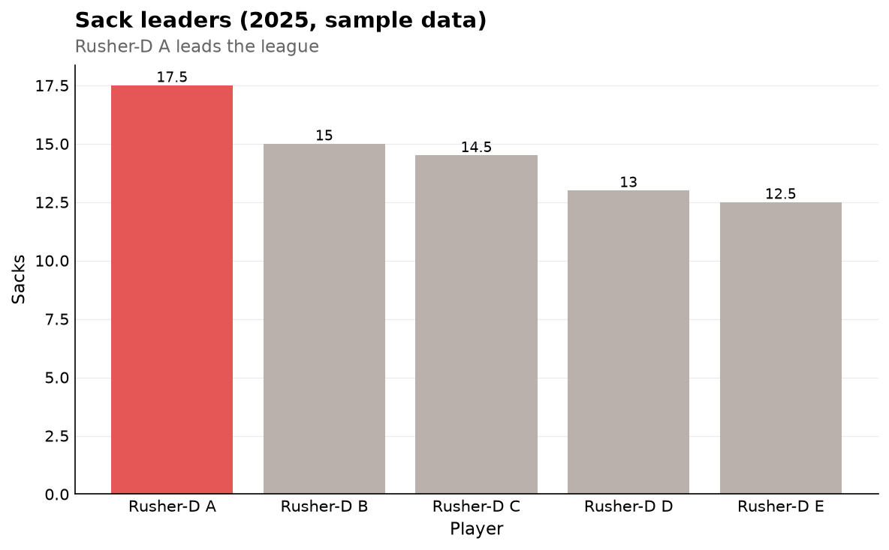
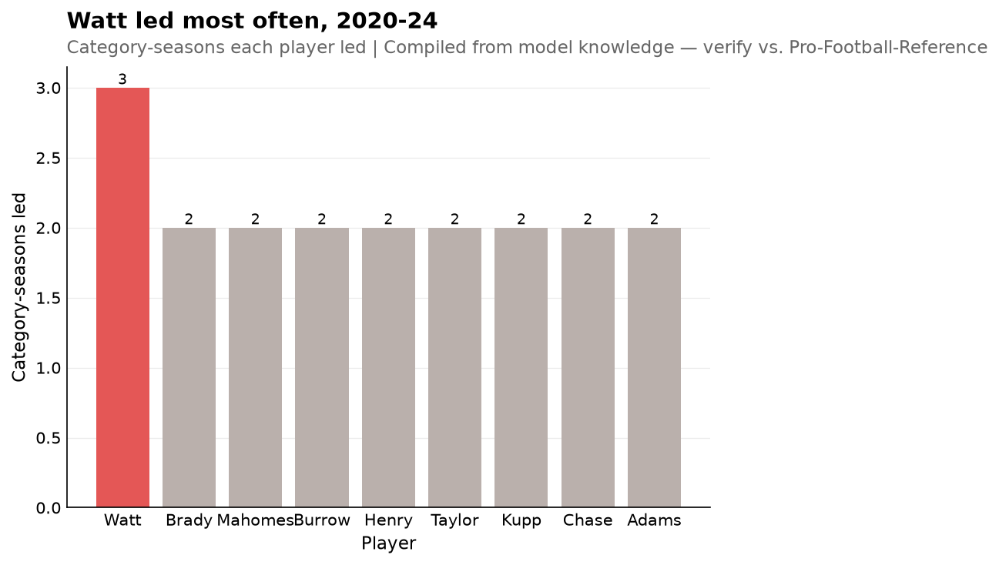

## nfl_totals.py

Builds [`../datasets/nfl_leader_totals_2020_2024.csv`](../datasets/nfl_leader_totals_2020_2024.csv)
by summing each player's totals across the seasons they led the league (see the
dataset README for what that total does and doesn't mean). The two stats where
leading multiple times creates a genuine outlier: **T.J. Watt** (56.5 sacks)
and **Davante Adams** (32 receiving TDs).

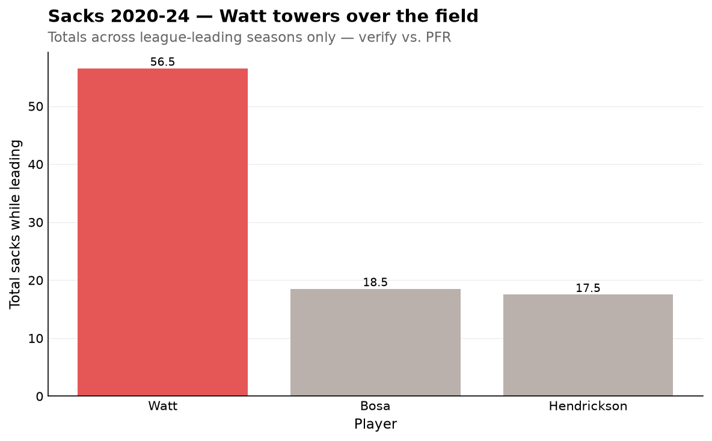
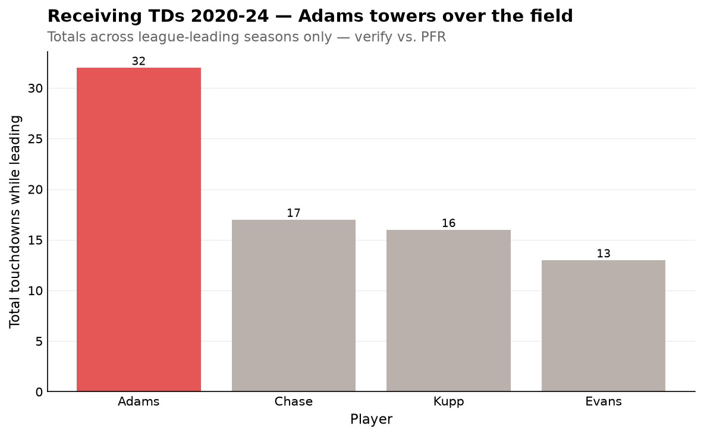
